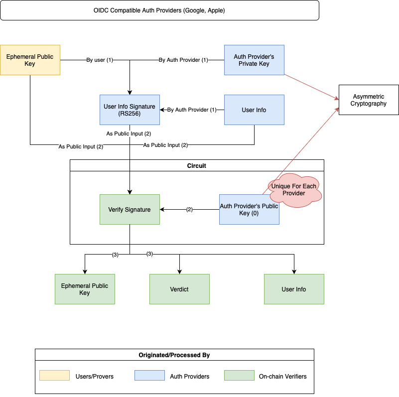

# Invisible Wallets on Telegram

## Overview

Invisible wallets enable users to perform Web3 transactions using their Web2 credentials, maintaining privacy by not publicly linking
their identities.

Many Web2 platforms, such as Google, Apple, and Microsoft, use [OAuth credentials](https://datatracker.ietf.org/doc/html/rfc6749),
which rely on the [RS256](https://auth0.com/docs/get-started/applications/signing-algorithms) algorithm, an asymmetric encryption
method. There are existing solutions for building invisible wallets with OAuth credentials. However, Telegram
uses [HMAC256](terms/hmac.md), a symmetric algorithm, which introduces unique challenges requiring a new approach.

This document outlines the current solution for OAuth providers and proposes potential solutions for Telegram's authentication system.
Although a complete solution for Telegram is not yet available, this guide provides insights to help in developing one.

The sections are structured as follows:

- **Section 2**: Invisible Wallets with OAuth (OIDC)
- **Section 3**: Telegram Authentication Challenges and Proposed Solutions

## Invisible Wallets with OAuth (OIDC)

For authentication providers that support OIDC, such as Google and Apple, invisible wallets can be created by following these
steps[^1][^2]:



1. The user generates an ephemeral wallet for blockchain interactions. After authenticating with the OIDC provider (e.g., Google), the
   user requests a JWT token signed by the provider, which contains the user's ephemeral public key. This JWT is signed using the
   provider's private key with the RS256 algorithm.
2. The user's information, ephemeral public key, and the provider's signature are passed into a Zero-Knowledge (ZK) circuit that also
   contains the provider's public key.
3. If the signature is valid, the smart contract links the user's ephemeral public key to their identity, allowing the user to interact
   with the blockchain using the ephemeral wallet, without needing traditional private keys.

## Challenges with Telegram's Authentication and Proposed Solutions

### Telegram's HMAC256 Authentication[^3]

Telegram's authentication system uses HMAC256. To verify the authenticity of data received from Telegram, the received hash parameter
must be compared with the hexadecimal representation of the [HMAC-SHA-256](terms/hmac.md) signature of the `data-check-string`, where
the secret key is the SHA256 hash of the bot token.

The `data-check-string` is a concatenation of all received fields, sorted alphabetically, such as:

`auth_date=<auth_date>\nfirst_name=<first_name>\nid=<id>\nusername=<username>`

Here's an example of the verification process:

```
data_check_string = ...
secret_key = SHA256(<bot_token>)
if (hex(HMAC_SHA256(data_check_string, secret_key)) == hash) {
  // Data is from Telegram
}
```

A proof of concept code is available [here](code/tele-login).

### Invisible Wallets for Telegram and HMAC256 Providers

The following process outlines how invisible wallets can be built with HMAC256-compatible providers like Telegram:


1. After authenticating with the provider (e.g., Telegram), the user requests a signed user information payload using the bot token.
2. The user generates an ephemeral wallet for blockchain interactions. The user information signature is then hashed (using a
   zk-friendly hashing algorithm) along with the user's ephemeral public key to create a value called Hash_E. This conceals the user
   information signature and prevents it from being linked to any wallet.
3. Inside a Zero-Knowledge circuit, the user information and bot token are used to securely re-compute the user information signature.
4. The circuit verifies Hash_E by combining the ephemeral public key, the calculated user information signature, and Hash_E.
5. If Hash_E is valid, the smart contract links the ephemeral public key to the user's identity, enabling interactions with the
   blockchain through the ephemeral wallet.

**Note 1**: The bot token is known only to Telegram and the app owner, ensuring that the app owner can verify the authenticity of the
signature when receiving data from Telegram. The bot token also allows the app owner to generate valid signatures. Unauthorized access
to the bot token must be prevented to avoid fraudulent signatures.

**Note 2**: Currently, there is no way to securely embed the bot token inside a Zero-Knowledge circuit without revealing it. This
limitation means the bot token cannot be fully protected within the circuit, posing a potential security risk.

### Exploring the Fully Homomorphic Commitment Scheme

An alternative approach to protect the bot token is explored in [this proposal](telegram_gsw.md) using a Fully Homomorphic Commitment
Scheme.

### Proving Telegram Auth with TLS Communication

Another possible solution is to build a ZK circuit that proves the secure TLS communication between users and the authentication
provider, indirectly proving account ownership.

There are several existing solutions that demonstrate TLS communication proofs, including:

- DECO: https://arxiv.org/abs/1909.00938
- TLSNotary: https://tlsnotary.org/
- zkNotary: https://github.com/vixuslabs/zkNotary

However, these solutions require trust in third parties, such as Oracle nodes, Trusted Execution Environments (TEEs), or Multi-Party
Computation (MPC).

Further discussion on this approach is available [here](tls_solutions.md).

[^1]: [zkLogin](https://docs.sui.io/concepts/cryptography/zklogin)
[^2]: [Keyless Account](https://aptos.dev/en/build/guides/aptos-keyless/introduction)
[^3]: [Telegram Authorization Check](https://core.telegram.org/widgets/login#checking-authorization)
