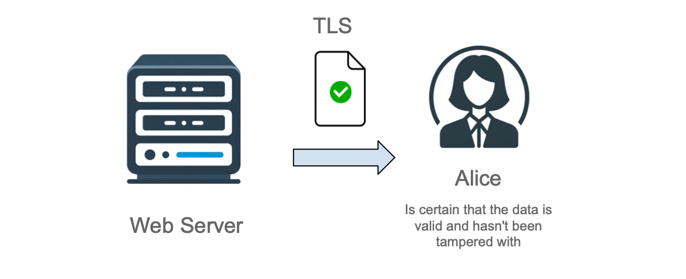
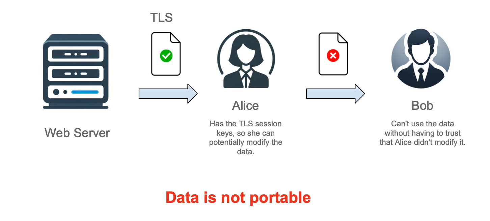
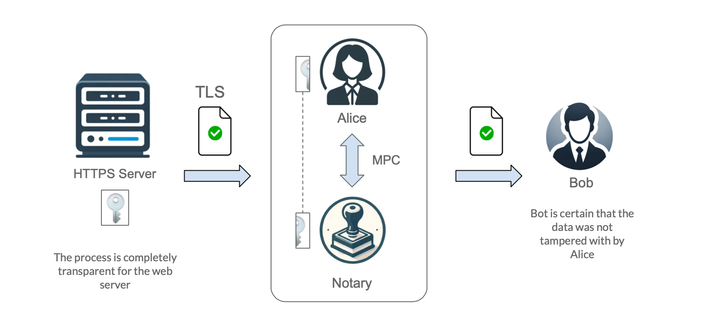

# Proving TLS Sessions with Zero-Knowledge Proofs

## Overview

Protocols like DECO[^1], TLSNotary[^2], and zkNotary[^3] allow users to prove facts about their TLS sessions to oracles while
preserving privacy. These privacy-preserving oracle protocols rely on cryptographic techniques to hide sensitive data during proof
generation.

### Key Properties

- **(+) Compatibility**: Works with modern TLS versions.
- **(+) No Trusted Hardware**: Does not rely on trusted execution environments.
- **(+) No Server-Side Changes**: No modifications needed from web servers.
- **(-) Oracle Trust**: Requires trusting the oracle nodes.

## How These Protocols Work

*The following excerpt is adapted from [zkNotary's GitHub page](https://github.com/vixuslabs/zkNotary), which provides an excellent
explanation.*

### TLSNotary: A Primer

#### TLS Basics

The TLS protocol ensures secure data exchange between a client (Alice) and a web server. TLS offers two critical guarantees:

- **Data Privacy**: The data is encrypted and only Alice can decrypt it.
- **Data Integrity**: Alice can be sure the data hasn't been tampered with during transmission.

#### The Data Portability Problem

When Alice needs to share data retrieved from a web server with a third party (Bob), Bob cannot trust the data without verifying that
Alice hasn't altered it. This problem highlights the lack of data "portability" under normal TLS conditions.

The encryption and signing keys for the TLS session are shared between Alice and the server, meaning Alice could tamper with the data
and re-sign it before presenting it to Bob.

#### TLSNotary's Solution

TLSNotary solves this problem by preventing Alice from gaining full access to the TLS session keys. This ensures that Bob can trust the
integrity of the data Alice presents.

#### How TLSNotary Works

TLSNotary prevents Alice from having complete control over the session keys by introducing a third-party "Notary" to participate in the
TLS session key negotiation. Using Multi-Party Computation (MPC), both Alice and the Notary hold partial session keys, ensuring that
Alice cannot re-sign data.

### TLSNotary Features

- **Server Independence**: Since everything occurs on the client side, the web server perceives the interaction as a normal HTTP
  request. No cooperation is needed from the web server.
- **Selective Disclosure**: Alice can redact sensitive portions of the data before sending it to Bob.
- **General-Purpose Notary**: The Notary learns nothing about the data being notarized or the web server involved, making it suitable
  for general use.

### Trust Assumptions in TLSNotary

Although Bob no longer needs to trust Alice, he must trust the Notary. There is a possibility of the Notary colluding with Alice to
modify the data. To mitigate this, Bob can:

- Require notarizations from multiple independent Notaries.
- Act as the Notary by running the Notary software himself, thus eliminating third-party trust.

---

[^1]: [DECO](https://www.deco.works)

[^2]: [TLSNotary](https://tlsnotary.org/)

[^3]: [zkNotary](https://github.com/vixuslabs/zkNotary)